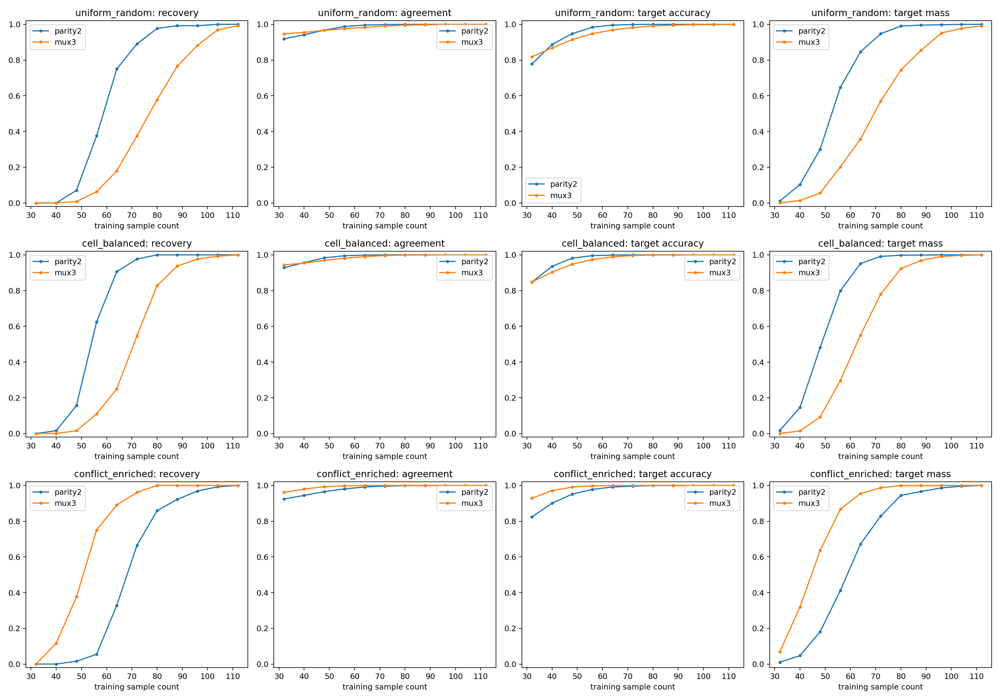
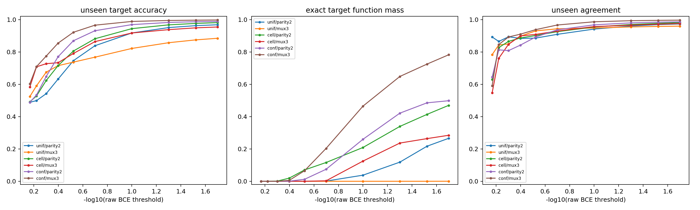

# E23：完整目标体积前瞻预测数据相变

## 目的

E23 在读取任何随机子集训练结果前，先用完整真值表 SMC 冻结八条8-bit 规则的局部体积收缩分数；随后训练9,736个随机数据集条件，检验静态体积能否前瞻预测`n50/n90`样本相变。2026-08-26 的三项补充实验继续追踪唯一稳定的 parity2/MUX3 跨族错序，并把缺失变量定位到 fixed-$D$ 竞争函数分母和采样辨识效率。

## 三项补充实验的闭环

1. **多目标 Gaussian 深尾 SMC**：random 相对 parity3/4 的浅层错序在深尾换序；MUX3 的完整目标体积则始终远大于 parity2，说明这组差异不能继续归因于 profile 读得不够深。
2. **Cell/conflict 真实训练干预**：uniform 和八格均衡都由 parity2 更早恢复；只提高 MUX selector 冲突样本权重，`n50` 从 parity2/MUX3=`64/80`翻转为`72/56`。
3. **Cell/conflict fixed-$D$ 静态 SMC**：无 optimizer 时复现同一排序。`epsilon=0.02`下，uniform、cell、conflict 的 parity2/MUX3 exact-target mass 分别为`0.266/0.000214`、`0.469/0.284`和`0.498/0.782`。

因此，full-target Neural K-profile 是强一阶预测量，但 grokking 相变还取决于特定训练集如何排除目标相关的竞争延拓；`n50/n90`是独立的协议相对辨识/恢复复杂度，不是静态 Neural K 的普遍同义定义。





## 运行顺序

```bash
python experiment_8bit_rule_volume_preregister.py
python experiment_8bit_volume_to_data_transition.py
```

针对阶段 A 浅层分数与跨族相变排序的三组错序，另有一个预注册的五分支共享父系综深尾确认实验。由于原 `Uniform[-1,1]` 参数立方体存在非零 BCE 下界，该后续实验采用同方差的无界 Gaussian 参考测度；它检验跨协议排序稳健性，不是原体积曲线的无缝续接：

```bash
python experiment_8bit_mismatch_joint_deep_bridge.py
```

原阶段 B 已包含每个 `n` 的 64 份随机训练集和每份 24 个 seed。可用连续 agreement 重新凝聚曲线细化粗网格相变位置：

```bash
python analysis_tools/analyze_agreement_subgrid_transitions.py \
  --result-dir /root/results_8bit_volume_to_data_transition
```

为判别 parity2/MUX3 的跨族错序究竟来自完整规则难度，还是来自相关格点数量和 MUX copy 捷径，另有一个固定 AdamW 的因果数据干预：

```bash
python experiment_parity2_mux3_coverage_shortcut_intervention.py
```

它比较均匀随机、八格均衡和 selector 冲突富集三种嵌套抽样协议，并把 parity2 作为冲突富集的负对照。

为直接测量这三种部分训练集下的静态竞争分母，而不是再借助 optimizer 轨迹，运行：

```bash
python experiment_parity2_mux3_fixed_d_static_smc.py
```

该实验固定`n=32`，对每种协议取8份数据集，在与 Gaussian full-target 深尾实验相同的参考测度下并行运行48个 fixed-D 条件。

- [实验动机与预注册](MOTIVATION_AND_PREREGISTRATION.md)
- [结果与边界](RESULTS_AND_CONCLUSION.md)
- [深尾错序确认预注册](DEEP_TAIL_FOLLOWUP_PREREGISTRATION.md)
- [Gaussian 深尾后续结果](DEEP_TAIL_FOLLOWUP_RESULTS.md)
- [Parity2/MUX3 覆盖与捷径干预预注册](COVERAGE_SHORTCUT_INTERVENTION_PREREGISTRATION.md)
- [Parity2/MUX3 覆盖与捷径干预结果](COVERAGE_SHORTCUT_INTERVENTION_RESULTS.md)
- [Parity2/MUX3 fixed-D 静态 SMC 预注册](FIXED_D_STATIC_SMC_PREREGISTRATION.md)
- [Parity2/MUX3 fixed-D 静态 SMC 结果](FIXED_D_STATIC_SMC_RESULTS.md)
- [三项补充实验精简结果资产](results/README.md)

## SHA256

```text
466a59d8e0a2243a9040d328dfef5e6f11c4ecb9893452b72024c6ecbe02fbb7  volume script
7b14e28ffd97a50da0af424e1bf755e72e82ad894e613cd129bcf00e5f742331  transition script
5df789c3976f59224b38ef63649a7ba9ce931cfa2c92c3d22098bd64d7e42f0c  Gaussian deep-tail script
234b87d39454d7fca35d7502ad76aa48329e8abece57f18aee8cbb81cd7812ce  coverage/conflict intervention script
fab1a8f12acb6c21d2396b0d9ecea8e6c4cfa23806d7f1ce513a5e7fb6a2c40d  fixed-D static SMC script
ebf266355364f25a0e694ea41863190cbf8a546025c1c49fda309fcb5c1172c5  volume ZIP
6e4075cae4fbd7072ab53f1e2764e65bbbf1934ced35f0301da965e8e0cd834d  transition ZIP
```

原始 ZIP 位于`E:\Downloads`，不进入发布包。
