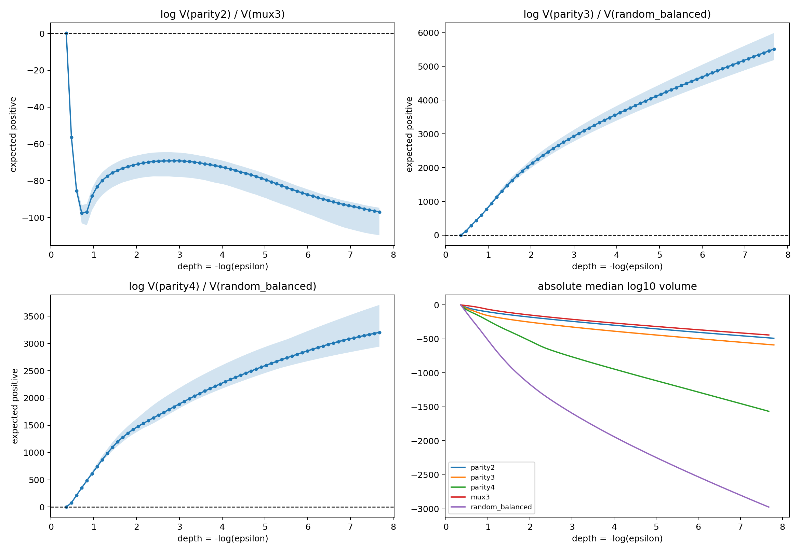

# E23：完整结果与阶段裁决

## 1. 确认性 parity 预测严格命中

完整数据上八条规则均可100%拟合并恢复目标 hard function。冻结的 parity 顺序与独立测得的样本相变为：

| 规则 | volume score | `n50` | `n90` |
|---|---:|---:|---:|
| parity1 | 125.21 | 24 | 48 |
| parity2 | 3266.21 | 64 | 80 |
| parity3 | 4618.60 | 96 | 112 |
| parity4 | 6719.58 | 160 | 160 |

四个`n50`和`n90`网格区间均互不重叠；Spearman 为1.0/1.0。该顺序从5,000步起已经稳定，不是40,000步截止点偶然产生。由此获得从完整目标静态体积到随机训练集辨识样本量的直接前瞻证据。

## 2. 跨族关系很强，但浅层单标量不够

全部八规则上，volume score 对`n50/n90`的 Spearman 为0.898/0.868；去掉随机规则后七条结构规则为0.955/0.927。预注册浅层割线分数相对于相变排序出现三组错序：MUX3/parity2、random/parity3、random/parity4。random 到`n=240`仍未恢复完整映射。

阶段 A 冻结的 score 只是一段浅 loss 割线。它是强一阶预测量，却不是跨任意函数族的充分统计量。后续深尾实验解决了 random 相对 parity3/4 的错序，但 MUX3/parity2 在 Gaussian 深尾仍稳定保持“完整 MUX3 体积更大、uniform 数据相变却更晚”的方向。这证明 full-target profile 与`n50/n90`本来就是相关但不同的对象，中间还包含固定训练集竞争分母、样本覆盖结构和 optimizer 可达性。

## 3. 复杂度排序本身随 loss 改变

random-balanced 的局部收缩率随 loss 深入急剧加速，并依次超过 parity2、parity3 和 parity4。绝对体积排名也发生交叉。用更深局部窗口预测`n50/n90`时，Spearman 从约0.73/0.71上升到0.97/0.95；用单截面`-log V`预测时也从约0.83/0.77升到0.95/0.93。

因此真正发生反转的是体积和局部速度在 profile 内部的排序；`n50/n90`相变本身没有反转，而是作为外部操作量指出浅层 score 读早了。

这迫使复杂度对象从单个数修正为完整 profile：

$$
K_f^N(\epsilon)=-\log V_f(\epsilon),\quad
s=-\log\epsilon,\quad
\kappa_f(s)=\frac{dK_f^N}{ds}.
$$

局部斜率、曲率和交叉都携带信息；任一浅层切片都可能遗漏深尾成本。

## 4. Agreement 复现分叉再凝聚

所有规则在`n=1`时 agreement 都接近1而目标函数质量为0。parity 随 n 增加先分叉，再按`parity1 -> parity4`的次序重新凝聚到目标函数；random 的 agreement 则持续降到约0.656且目标质量始终为0。高 agreement 只代表当前函数分布窄，不代表外部正确。

每个相同 $n$ 已随机重复64份训练集，每份24个seed，因此 agreement 还能细化`n50/n90`的粗网格。后验诊断从每条曲线的 agreement 最低点后开始，要求 unseen target accuracy 至少0.90，并对 mean unseen agreement=0.99 做 isotonic 拟合和线性亚网格插值。2,000次 dataset bootstrap 结果为：

| 规则 | agreement=0.99估计 | 95% bootstrap区间 |
|---|---:|---:|
| parity2 | 59.98 | [58.77,61.07] |
| MUX3 | 69.47 | [65.02,72.40] |
| parity3 | 88.94 | [85.72,91.05] |
| parity4 | 151.93 | [149.65,153.81] |
| random-balanced | >240 | 100%右删失 |

在相同`n=64`的配对随机子集上，parity2 agreement 比 MUX3 平均高0.0106，paired-bootstrap 95%区间[0.0078,0.0134]。这支持用“同 n 多随机几次”的 agreement 比较相对复杂度，但该阈值和插值是在看到原数据后增加的诊断，不能冒充预注册结果。

## 5. Gaussian 深尾把唯一稳定错序留给 MUX3/parity2

五目标共享父系综的 Gaussian SMC 推进到最深共同阈值约`0.0004635`。Random-balanced 相对 parity3/4 的体积比和相对收缩速度均在8/8 replica 中支持操作性相变方向。Parity2/MUX3 则没有交叉：最深处

$$
\log\frac{V(\mathrm{parity2})}{V(\mathrm{MUX3})}\approx-96.9,
$$

即 MUX3 完整目标体积约大 $10^{42}$ 倍。这个结果否定“所有跨族错序只需读取更深 full profile 就会消失”。

## 6. 定向采样把真实训练相变完全翻转

固定网络、AdamW、训练预算和目标函数，只改变训练样本分布：

| 协议 | parity2 `n50/n90` | MUX3 `n50/n90` |
|---|---:|---:|
| uniform | 64 / 80 | 80 / 104 |
| cell-balanced | 56 / 64 | 72 / 88 |
| conflict-enriched | 72 / 88 | **56 / 72** |

Cell balancing 同时帮助两条规则，却保留准确率75%的 `copy x1/x2` 捷径，因此 MUX3 仍较晚。把 selector 冲突样本提高到75%后，MUX3 的`n50/n90`相对 uniform 提前24/32个样本，parity2反而各推迟8个。2,000次配对 bootstrap 和500--40,000步的逐时刻分析都保留该方向。

## 7. Fixed-D 静态 SMC 复现反转并定位竞争函数

固定`n=32`，对三协议、两目标、每协议8份数据集运行 Gaussian constrained SMC。全部条件 hard-fit 后，`epsilon=0.02`的 exact-target mass 为：

| 协议 | parity2 | MUX3 |
|---|---:|---:|
| uniform | 0.266 | 0.000214 |
| cell-balanced | 0.469 | 0.284 |
| conflict-enriched | 0.498 | **0.782** |

Uniform-MUX3 的 agreement 已达0.959却几乎不选择真实目标；conflict-MUX3 的目标在8/8数据集中都是 modal function。按未见语义格分解，uniform 在普通格的目标准确率为0.993，在 selector冲突格仅0.777；conflict将冲突格提高到0.995。

所以真实训练中的相变反转已经存在于 fixed-$D$ 静态竞争分母，AdamW 不是制造定性顺序的必要条件。Optimizer 仍影响幅度和 parity2 等局部效应。

## 8. 最终分层与边界

- parity 是预注册确认性家族，跨族曲线诊断包含事后分析；
- `n50/n90`是样本数网格上的区间 crossing，不是无限精度点；接近规则必须同时看相邻网格和 bootstrap 区间；
- 未在 $n<N$ crossing 的目标只能记为右删失；`n=256`完整数据仅作可达性对照；
- `n50/n90`是协议相对的操作阈值，不是机器无关样本复杂度；
- full-rule profile 强烈预测数据相变，但并未单独决定所有跨族排序；
- `n50/n90`应称为协议相对辨识/恢复样本复杂度，而不是 full-target Neural K 的同义标量；
- fixed-$D$ 深尾 lineage 多数降到每 replica 约1--2条，绝对 target-mass 小数只作粗略估计；主判决依赖跨 loss、8份数据集、replica、定向干预和真实训练外部对照；
- profile 为何具有特定形状仍是本文明确不求解的微观数学问题。
