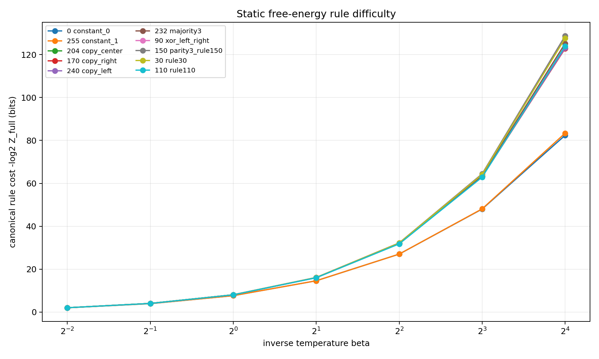
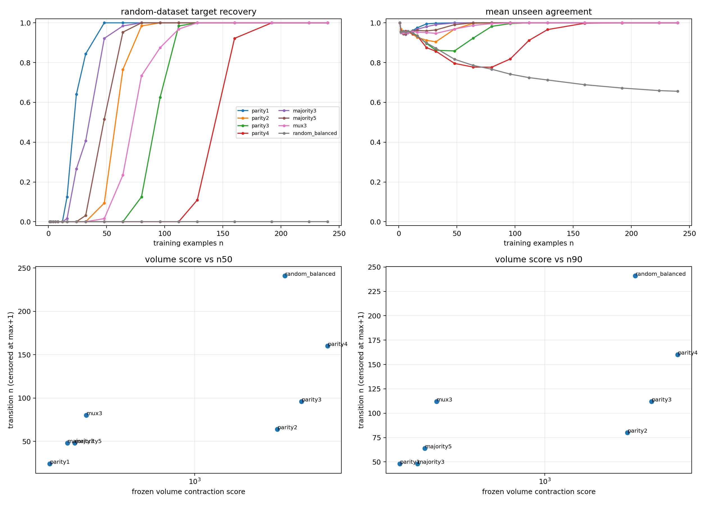
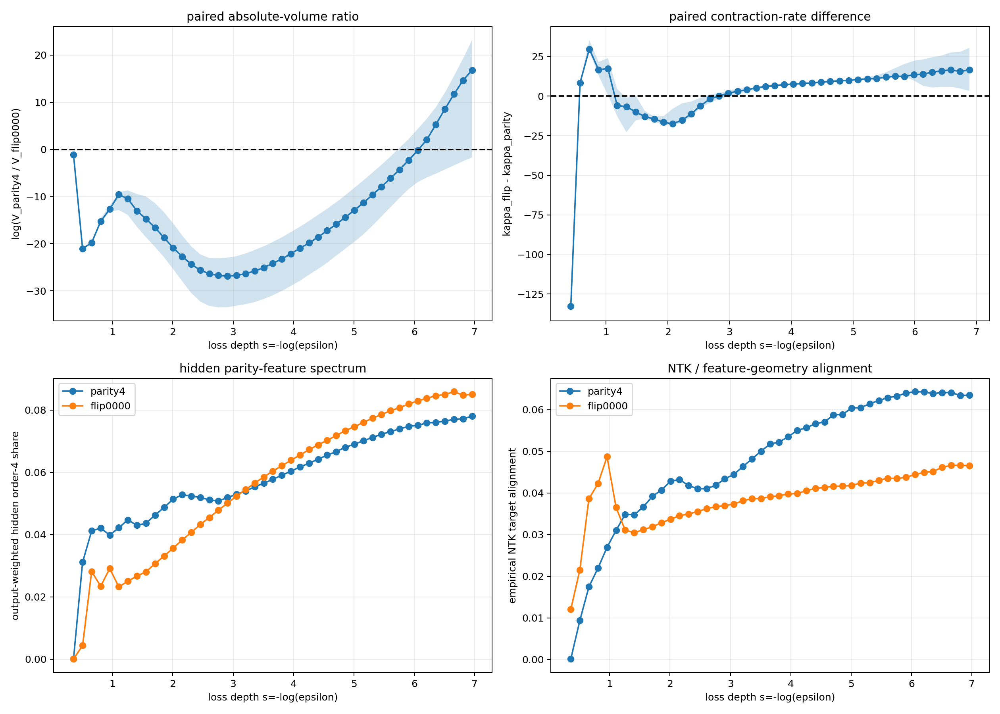
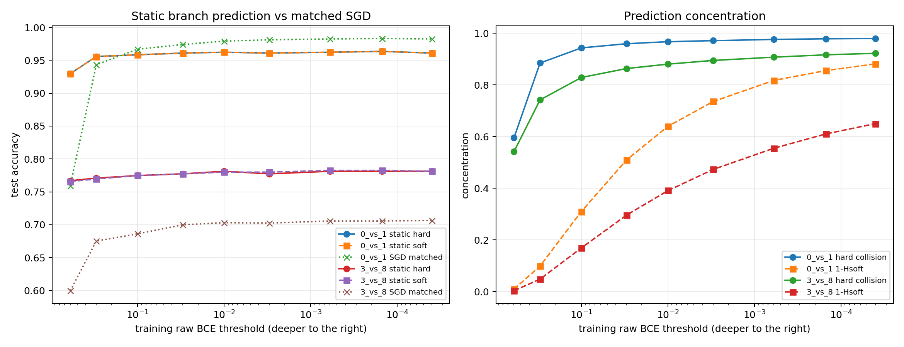

# How Training Loss Selects Functions: From Static Volume to Grokking and Overfitting

> This is a research narrative rather than a submission-ready paper. Its purpose is to make the conceptual turns, experimental objects, measurements, results, and interpretations understandable.
>
> Complete numbers, scripts, and caveats are available in the [experiment archive](experiments/index.html). The longer [evidence ledger](evidence-ledger.html) retains the detailed audit trail.

## The conclusion first

A neural network is explicitly asked to do one thing during ordinary supervised training: lower its training objective. It is not told which “true rule” generated the data, nor is it separately instructed to generalize, compress, or form concepts.

Yet different parameter settings implement the training set in very different ways. Some merely fit a handful of points; some reuse one rule over a large input space. Some store many unrelated exceptions; others share one computation across outputs and tasks. Architecture and parameterization give these implementations very different masses in parameter space. Tightening the training-loss requirement removes their mass at different rates.

Training loss is therefore not only a binary switch between “fits” and “does not fit.” It is also a continuous resolution knob. As the requirement becomes stricter, some functions and implementations become fragile while others gain relative mass. This process need not be monotone for every preselected function, and it cannot be summarized by one permanent complexity score. The more appropriate object is a curve: how much parameter mass remains for a target at each loss precision. We call this curve the Neural K-profile.

Optimization is a separate layer. Static volume tells us what regions exist in the landscape and how large they are. SGD or AdamW determines which regions are actually reached from random initialization, which entrances are blocked, and which paths are followed. The two are strongly related but not identical.

The remainder of this document follows the order in which these conclusions were actually forced by the experiments.

## What had already been observed before this theory

The project did not begin with 3-bit toy tasks. Over more than a year, the repository accumulated over one hundred research directions and experimental variants. Their evidential maturity differs: some have saved curves, weights, and multi-seed results; some have partial results; others are generators, pilots, or explicit failures. “More than one hundred experiments” should not be read as more than one hundred publication-ready successes.

They nevertheless form a broad and difficult-to-ignore family of phenomena:

- one- and two-dimensional cellular automata, including Rules 30, 90, and 110, multi-step evolution, inverse rules, and programmable rule codes;
- multi-base addition, shuffled positional encodings, multiplication, logical expressions, modular arithmetic, and RSA data generators;
- trapping rain water, edit distance, graph propagation, mazes, Towers of Hanoi, Lights Out, and several dynamic-programming tasks;
- clocks, geometric trajectories, refraction, rotation, and image transformations;
- MNIST coupled to rule execution, class-conditional rules, rule bits, masks, prefixes, and unseen rule combinations;
- pilots with MLPs, CNNs, Transformers, ConvNeXt, Swin, and MLP-Mixer;
- and clear failures or scaffold-dependent cases such as Mod 3, parity, recursion, and deep composed rules.

When data are clean, the information path is available, and optimization can reach the relevant solution, ordinary neural networks often recover exact deterministic transformations from far fewer examples than the full input space. In many data-rich tasks, training and validation losses fall together from the beginning and the model remains nearly exact over a vast unseen space. The observed behavior includes discrete rules, compositional semantics, and multi-step computations, not only local visual interpolation.

The failure boundaries are equally stable. Some representations entangle information so strongly that optimization stalls. With insufficient data, the full function does not concentrate. Parity and Mod 3 exhibit severe entrance barriers. Increasing capacity sometimes helps and sometimes hurts. Changing architecture can move the transition and reverse relative task preferences.

These observations impose three constraints on any explanation: networks really can learn a broad class of exact rules; data identifiability, representational capacity, and optimization accessibility are distinct; and a theory must explain both broad success and structured failure. The small Boolean and SMC experiments below do not replace this broad matrix. They make its underlying mechanisms fully measurable.

## 1. The initial question: can the initialization prior already explain function selection?

The project initially faced a strong and appealing static picture.

Randomly initialized networks do not generate all functions uniformly. Some simple functions are intrinsically much more probable. One can therefore imagine that training creates no new preference: it merely deletes functions that disagree with the training labels, leaving the initialization prior to determine the relative probabilities of all compatible functions.

This idea is close to the function-prior program developed by [Dingle, Camargo, and Louis (2018)](https://www.nature.com/articles/s41467-018-03101-6), [Valle-Pérez, Camargo, and Louis (2019)](https://arxiv.org/abs/1805.08522), [Mingard et al. (2019)](https://arxiv.org/abs/1909.11522), and [Mingard et al. (2021)](https://www.jmlr.org/papers/v22/20-676.html). It explains many first-order generalization phenomena. The question is whether it is merely a good approximation or the training mechanism itself.

Accuracy alone cannot decide this. We need to know which complete function the network selects before and after training.

### Experiment 1: count complete functions in a 3-bit space

**What alternatives were tested?**

If training is only hard conditioning of the initialization prior, then for a fixed training set the distribution produced by actual training should match the distribution obtained by filtering random networks for training-label consistency. Once every training example is classified correctly, further optimization should not systematically alter unseen inputs.

**What was done?**

[E01](experiments/e01.html) uses 3-bit inputs and one binary output. There are only eight inputs and 256 possible Boolean functions, so every network can be assigned an exact full truth table.

We first generated 1,048,576 untrained networks to estimate the initialization function prior. For several tiny training sets, we then constructed two distributions: a static distribution obtained by retaining only random networks that fit the labels, and an optimizer-induced distribution obtained by actually training 8,192 initializations and reading the complete function at first fit, 100 steps later, and 1,000 steps later.

**What was measured?**

We compared the probability of every one of the 256 functions, the total-variation distance between distributions, function rankings, and paired per-seed function changes.

**What happened?**

The trained distributions differed from hard conditioning by far more than sampling noise. In some conditions, the function preferred by the static posterior lost its lead after training and another function became dominant. With the training set unchanged, another 100 optimization steps increased the difference.

An even more direct one-example version used a wide three-hidden-layer network. After conditioning on the single training label, about 72% of compatible random networks were still nonconstant over the other seven inputs, so the static prediction assigned only about 28% mass to the target constant. Actual training sent all 128 of 128 networks to that constant in one optimizer step. The same happened when the analysis retained only networks that had already classified the training point correctly at initialization.

**What changed in the theory?**

The initialization prior remains important, but training is not merely deletion. Optimization transports parameter mass between complete functions even when both functions already satisfy the training set. Static mass and optimizer-induced transport must be represented separately.

### Experiment 2: does the function keep changing after interpolation?

The tiny Boolean case might have been protocol-specific. [E04](experiments/e04.html) therefore moved to 7-bit inputs, all 128 possible states, and a ten-layer tanh network. Six conditions produced 12,288 trajectories.

Instead of stopping at the first zero training-classification error, we continued for another 100 and 1,000 steps, saving each trajectory’s complete 128-bit function while training classification remained perfect.

Roughly 60% to 99.8% of models changed their complete function during post-fit training. Under the larger initialization scale, a model flipped about fifteen unseen inputs on average.

Zero classification error is therefore only a coarse threshold. BCE can still fall, logit margins can still grow, and complete functions can still move. The delayed generalization reported by the original [Grokking study of Power et al. (2022)](https://arxiv.org/abs/2201.02177) cannot be reduced to one hard-conditioning event.

## 2. The first major turn: perhaps loss depth matters more than elapsed time

After confirming post-fit function change, it was natural to attribute everything to SGD dynamics: perhaps the optimizer wanders among functions and eventually remains in simpler ones.

But a more basic fact remained: whatever path the optimizer follows, it continually lowers training loss. This suggests a static question that can be asked without training at all: among parameters implementing different complete functions, do relative volumes change when the training-loss threshold is tightened?

If all compatible functions shrink proportionally, then very low loss adds little to function selection once labels are correct. If their volumes shrink differently, lowering loss itself creates a new selection pressure.

### Experiment 3: sample once, then slice parameter space by raw BCE

[E06](experiments/e06.html) sampled 4,194,304 3-bit networks and saved their logits over all eight inputs. From this one sample, any small training set’s raw BCE and every network’s hard function could be reconstructed offline.

The analysis first retained networks whose hard predictions fit the training set, then tightened raw-BCE quantiles and recomputed the 256-function distribution at each depth.

For a two-example dataset, a symmetric threshold function preferred by real SGD occupied only about 1.6% of all hard-exact networks but rose to roughly 23%–51% in the deepest measured tail. Continuous loss clearly contained function-selection information beyond hard consistency.

A four-example dataset supplied the necessary counterexample. The combined mass of two leading functions first increased and then fell as the loss tail deepened, while other functions took over. The static distribution at matched loss also differed from the SGD distribution.

The surviving statement was therefore not “one prespecified simple function rises monotonically.” It was the weaker and more useful claim that continuous loss reweights functions in a function-specific way, and different loss ranges may favor different functions.

### Experiment 4: avoid calling every winner “simple” after the fact

A theory becomes unfalsifiable if every function selected by the network is retrospectively declared “simple for the network.” [E10](experiments/e10.html) therefore preregistered strictly ordered function pairs.

The simple members were projections, AND, or OR, each expressible by one linear threshold unit. The complex members shared the same training inputs, labels, and full output balance, but introduced exceptions on unseen inputs; linear programming certified that they were no longer linearly separable. Both members fit the training set, so the experiment did not compare fit versus non-fit.

Within the same random-network population, the experiment measured how the simple-to-complex odds changed in deeper raw-BCE tails. Reliability criteria prevented decisions from being based on a handful of rare samples.

All 12 reliable pairs shifted toward the simple function, and all shifts were statistically significant. The mean odds amplification was about 10.6-fold for GELU networks and 5.1-fold for tanh networks.

This established that lower raw BCE favors independently ordered simple compatible functions in these controlled pairs. It did not establish one global ordering over every dataset and every loss scale.

## 3. The second major turn: “the simple answer” must be relative to the training set

Even after E10, it remained easy to smuggle the known data generator into the analysis. A finite training set generally admits many compatible extensions, and the generator has no intrinsic privilege inside the optimizer.

### Experiment 5: why ten AND examples first produce a shortcut

[E12](experiments/e12.html) studied a 4-bit AND target with ten training examples. The four local AND patterns were represented very unevenly.

AND is short and compatible with every training label. A strong monotonic simplicity law would therefore predict that its probability rises throughout loss tightening. Instead, static sampling at intermediate loss favored a conditional shortcut, and real training entered the same function in large numbers. Candidate odds changed order across loss ranges.

We then replaced only one example to balance the four AND patterns while leaving the rest of the protocol as unchanged as possible. In the balanced dataset, AND gained much more deep-loss static mass, and roughly 64% of long-run training endpoints implemented AND.

The result was not that the network mysteriously rejected a simple rule. The original dataset did not express AND evenly. One example was enough to alter both static geometry and optimizer endpoints. Simplicity is jointly determined by the network language and the actual training constraints.

### Experiment 6: one complete function can fall and later rise as loss decreases

[E14](experiments/e14.html) deliberately created two loss scales. Most weighted examples followed Rule 110, while a tiny conflict region required Rule 30. The full target had to handle both.

At high loss, learning Rule 110 alone removes almost all error. Only at very low loss do the rare Rule-30 conflicts become unavoidable.

The full composite function was not favored at higher loss and rose only in the deep tail. It did not monotonically grow from initialization. The network prioritized whichever part of the weighted training objective delivered the largest immediate loss decrease.

Shortcuts, stagewise learning, and late rule takeover can therefore be rational outcomes at different loss resolutions. The network need not be moving toward the researcher’s complete rule from its first step.

## 4. The third major turn: a favorable endpoint and an accessible entrance are different questions

Parity provides an unusually sharp stress test. Humans describe it with one short instruction—XOR all bits—yet ordinary MLP training becomes trapped near a loss of 0.693 as dimension rises.

Two explanations are possible: either low-loss parity solutions have negligible or unstable volume, or good endpoints exist but random initialization cannot cross the entrance barrier.

### Experiment 7: place the network inside the solution region, then test whether it stays

[E16](experiments/e16.html) first trained 12-bit and 14-bit parity using half of the truth table. Whenever training loss escaped the initial plateau, test accuracy quickly rose to 96%–99.9% and continued improving as loss fell.

The decisive 16-bit experiment used auxiliary decomposition information to reach a low-loss parity solution, removed all auxiliary supervision, strongly perturbed the parameters, and resumed training only on the original endpoint task. A wider network returned to the parity solution.

In this protocol, the main difficulty was global entrance, not the absence or local instability of a low-loss parity endpoint. Static preference and optimization accessibility must be kept separate.

### Experiment 8: at the same loss, do SMC and AdamW choose the same functions?

[E17](experiments/e17.html) compared constrained-SMC distributions with large AdamW endpoint ensembles on the balanced AND dataset. It also initialized AdamW from a function with high deep-tail SMC mass and observed where training moved it.

At similar losses, SMC and AdamW could have different dominant functions. AdamW rapidly left the selected SMC state and flowed into its own attractor family.

Static volume is therefore best viewed as a first-order weight supplied by the landscape. Optimization further reweights it through entrances, gradients, connectivity, and history. When data are abundant and one rule dominates the relevant loss region by overwhelming mass, optimizer details may no longer change the hard function. In underconstrained or rare-event regimes, dynamics may dominate.

## 5. Measuring the difficulty of a complete rule directly

Partial datasets can induce unexpected functions, making it difficult to guess the network’s preferred extension. A cleaner measurement supplies the full truth table of one rule and asks how much parameter mass remains when the whole rule must be fitted to progressively stricter loss.

### Experiment 9: how simple and complex complete targets separate

[E19](experiments/e19.html) used 4-bit inputs, so each complete target contained sixteen examples. A fixed two-layer tanh MLP was evaluated on parity1–4, majority3, and a preregistered balanced random function using constrained SMC.

At each tighter loss threshold, the experiment recorded the surviving fraction of the particle population. Multiplying survival fractions gave a low-loss volume curve for each target.

Parity1–4 retained a strict order over the common reliable range: more participating parity bits meant less low-loss volume. Majority3 and the random balanced function were more revealing. Their volumes were similar at shallow loss, then separated by thousands of times and eventually about eighteen decimal orders as loss tightened.

Target difficulty is thus not only an initialization-prior effect. Two targets can be comparably easy to fit coarsely and diverge only under high precision. This may partly explain why complex targets take longer to discover: their deep-tail regions are smaller.

The experiment also exposed architectural relativity. Parity2 is short in ordinary logic but can be harder for this tanh MLP than a preregistered random balanced map. The architecture defines its own representational language.

### Experiment 10: relate full-rule volume to candidate volume under a partial dataset

Full-rule volume asks how much parameter mass fits all sixteen points. Candidate competition under a partial dataset asks which complete extension is produced when only ten points are constrained. These are not the same quantity and cannot be substituted without a bridge.

[E20](experiments/e20.html) built three closure tests. A constant leave-one-out task compared the all-zero function with a one-point exception. A balanced-AND task repeated the comparison for four candidate functions. Independent full-rule SMC ratios and conditional-event ratios measured inside the partial-dataset parent agreed with maximum log residuals of about 0.071 and 0.049.

The final bridge fixed training loss and hard function, then progressively required larger correct margins on six unseen points. The internal volume of the four hard functions continued to separate.

Full-rule volume and fixed-dataset candidate mass are distinct but live under one measure and obey exact conditional-probability identities. Enormous volume differences can develop inside a hard truth-table cell through logit and margin geometry.

### Experiment 11: can per-example information accumulate to an endpoint invariant?

Early experiments added the eight 3-bit samples one at a time and measured how surprising each new label was under the current ensemble. Intermediate values depended on order, and no stable total had been identified.

[E22](experiments/e22.html) exhaustively reconstructed the problem. It saved logits from 2,097,152 prior networks. Each of the eight inputs could be absent, labeled zero, or labeled one, producing 6,561 partial datasets. For every one of the 256 complete rules, all 40,320 sample orders were enumerated.

The generalized surprise of a new example was measured by the loss of remaining parameter mass. Individual increments depended on order, but the total over all eight examples depended only on the final rule. The maximum numerical discrepancy was approximately 10^-14 bits. Rule 150, parity3, had the highest hard endpoint cost among all 256 rules.

This is not a conservation law for real SGD. It shows that predictive cost and complete-rule endpoint difficulty are differences of one static potential under a fixed measure. It connects the earlier agreement and surprise intuitions to the prequential measurements of [Blier and Ollivier (2018)](https://proceedings.neurips.cc/paper_files/paper/2018/hash/3b712de48137572f3849aabd5666a4e3-Abstract.html) and the neural-network statistical mechanics of [Levin, Tishby, and Solla (1989)](https://mlanthology.org/colt/1989/levin1989colt-statistical/).

*Figure 1. Representative endpoint costs in E22. Rule costs separate as the precision pressure increases under one reference measure.*

## 6. The strongest prospective test: can a volume curve predict sample requirements?

A circularity risk still remained. Calling small volume “difficulty” and then explaining small volume by difficulty predicts nothing. A falsifiable test must measure complete-rule volume first, freeze the ranking, and predict an independent experiment: how many random partial examples are needed to recover the rule.

### Experiment 12: freeze volume rankings, then train 9,736 dataset conditions

[E23](experiments/e23.html) used 8-bit inputs and a two-hidden-layer tanh network with width sixteen. Targets included parity1–4, majority3, majority5, MUX3, and a balanced random rule.

Stage A used each full 256-state truth table to measure a preregistered volume-contraction score. No random-subset training result had yet been run or inspected; the target order and its file hash were frozen.

Stage B drew 64 random training sets for each target and sample size, with 24 paired initializations per dataset. Recovery required training fit, a target modal complete function, sufficient target mass, and sufficient cross-seed concentration. The experiment then recorded the smallest sample size at which recovery probability reached 50% and 90%.

| Rule | Frozen volume score | Samples for 50% recovery | Samples for 90% recovery |
|---|---:|---:|---:|
| parity1 | 125.21 | 24 | 48 |
| parity2 | 3266.21 | 64 | 80 |
| parity3 | 4618.60 | 96 | 112 |
| parity4 | 6719.58 | 160 | 160 |

The four transition intervals did not overlap, and the rank correlation was 1. Complete-rule volume predicted the random-dataset transition ordering of the parity family before the training results were known.

*Figure 2. Top left: complete-function recovery versus training-set size. Top right: unseen-input agreement. Bottom: frozen volume score versus n50 and n90.*

Across all eight targets the correlation remained strong, but three clear reversals appeared: MUX3 versus parity2, and the random target versus parity3 and parity4. Inspecting the full curves showed that the random target’s contraction accelerated sharply with loss depth and eventually exceeded the parity targets. Deeper local information correlated better with final sample transitions.

The theory therefore changed again. A rule should not be assigned one precision-independent score. Initialization probability, volume at one loss, and one local slope are all partial views. The relevant object is an entire precision-dependent curve: a target can be easy to fit coarsely and expensive in the deep tail. This curve became the Neural K-profile.

## 7. Deep-tail reversal after the hard function is already fixed

E23 showed that a shallow slope was insufficient, but left open whether rankings eventually stabilize at low loss.

### Experiment 13: search 54 functions for a credible crossing pair

[E24](experiments/e24.html) used 4-bit inputs, one hidden tanh layer, and a standard Gaussian reference measure. The panel included six structured rules, all sixteen one-point perturbations of parity4, sixteen two-point perturbations, and sixteen balanced random functions. SMC advanced from loss 0.7 to 0.019, well beyond the threshold at which every particle had the correct hard signs.

Parity4 had the smallest absolute volume among all 54 targets over the measured range. Nearly every random and exception target contracted more slowly. The sole persistent challenger was parity4 with the label at 0000 flipped. Its absolute volume was still larger at the stopping point, but its last several contraction rates were reliably faster. Extrapolation predicted a crossing near loss 0.0025.

### Experiment 14: use a shared parent ensemble and observe the crossing directly

To remove independent-SMC normalization offsets, the second experiment branched both targets from one parent particle population and advanced them at identical thresholds.

The median volume ratio crossed at approximately 0.002308, close to the preregistered extrapolation. At the deepest threshold, the one-point exception had about twenty million times less median volume than parity4. Seven of eight replicas had crossed in absolute volume, while all eight still had contraction-rate differences in the same direction. The stricter preregistered condition—eight of eight replicas remaining crossed for five consecutive windows—was not met, so the result is reported as 7/8 rather than complete convergence.

*Figure 3. Crossing of the zero line in the upper-left panel marks reversal of the median absolute-volume ordering. The upper-right panel shows that the exception continues contracting faster afterward.*

Both targets had long been 100% hard-exact, and representation diagnostics changed smoothly near the crossing. The reversal accumulated through continuous within-cell geometry rather than a sudden hard-function switch. Neural K must therefore be a profile, not a hard-function ID, prior probability, or permanent slope.

## 8. Can the method leave Boolean truth tables?

If function-volume reasoning worked only in 3-bit and 4-bit spaces, it would remain an elegant toy. We therefore moved the same measurement to MNIST.

### Experiment 15: determine whether the same four examples are sufficient for two tasks

[E25](experiments/e25.html) average-pooled MNIST to 7×7 inputs and used a tanh MLP with 1,633 parameters. It compared 0-versus-1 and 3-versus-8 classification with training-set sizes from 4 to 512, four random datasets per size, and eight seeds per dataset.

With only four balanced examples, median test accuracy at the best validation-loss checkpoint reached 98.31% for 0/1 but only 69.66% for 3/8. Under an operational 95% validation-accuracy threshold, 0/1 crossed at four examples while 3/8 required 512.

The same architecture, sample count, and training budget can therefore represent radically different data sufficiency. This provides a strong easy-versus-hard control for testing static volume on real inputs.

### Experiment 16: predict one unseen image by comparing two static label branches

The second stage fixed one four-image dataset for each task and nine training-loss thresholds. SMC sampled all parameters fitting the four images to the required loss.

For each unseen image, the parent population was split into parameters predicting label zero and parameters predicting label one. The hard static prediction chose the branch with more parameter mass; the soft prediction compared average probabilities. No new classifier was trained, and the test image was not added to training.

Static hard accuracy on 0/1 rose from 92.97% at shallow loss to a peak of 96.35%. On 3/8 it rose from 76.69% to about 78.13%. Four training images were already enough for static parameter volume to make strong predictions over hundreds of unseen images.

*Figure 4. Left: static hard/soft branches versus matched-loss SGD. Right: continued concentration of the prediction distribution as training loss deepens.*

Soft NLL was more revealing. As the training-loss threshold tightened, unseen-image NLL improved, reached a minimum, and worsened. The static 0/1 minimum was one preregistered loss grid cell from the real AdamW validation minimum. The 3/8 static interval directly covered the real training turning point.

Task and loss range had been chosen using a calibration stage, so this is a calibrated confirmation rather than a fully blind prediction on new digits. The next test must freeze the current rule and predict a new digit pair.

Why can hard accuracy remain high while NLL worsens? Per-image analysis showed that deeper loss still corrected a few boundary examples while making persistent mistakes more confident. Hard accuracy, calibration, and agreement can therefore turn at different depths.

Under the same four-example condition, the deep-loss mass disadvantage of 3/8 relative to 0/1 grew from about half a decimal order to roughly 55 decimal orders, in the same direction as the four-versus-512 sample requirement. Rule volume, real-image prediction, and data requirement were connected in one experiment.

## 9. What the agreement line of work ultimately established

Early overfitting experiments trained many random initializations and compared predictions over large probe sets. If nearly all seeds gave the same answer at one probe input, that point had high agreement. If many seeds shared the entire probe truth table, the complete function distribution had genuinely concentrated.

It was tempting to interpret low-agreement overfitting as one strange but humanly unreadable simple rule. That conclusion was unsupported. The direct meaning of low agreement is that the complete function has not concentrated and many extensions remain in competition.

High agreement does not imply recovery of the researcher’s external generator. With one training example, networks may unanimously choose a constant function and achieve near-perfect agreement while ignoring that hidden generator. Yet the constant is itself an extremely short, human-readable rule, so this does not contradict the readability conjecture below. It shows that agreement measures the rule jointly selected by the dataset and neural protocol, not the researcher’s teacher.

### Experiment 17: what functions appear under high consensus without a teacher?

[E18](experiments/e18.html) generated random 8-bit training sets and trained 64 seeds per set. Candidate datasets with concentrated complete functions were re-audited with up to 4,096 fresh seeds, and their modal functions were subjected to symbolic-complexity analysis.

Among 8,192 random datasets, 46 strictly high-consensus endpoints survived fresh-seed confirmation. A unified post-hoc audit found that all were signed linear-threshold functions. No high-consensus random lookup table was observed.

The “all threshold functions” pattern was discovered after seeing the candidates, so it is not a preregistered family prediction. The defensible result is narrower: under this MLP protocol, functions that concentrate reliably from few random examples fell into short, exactly describable symbolic families.

### Experiment 18: can labels actively induce concentration or preserve a split?

[E21](experiments/e21.html) began with small random training sets. At each round, it selected the unseen input on which the current committee was most divided and retrained paired branches under candidate labels zero and one.

Choosing the branch that increased final agreement rapidly concentrated the function distribution. Choosing the branch that preserved disagreement maintained the split. When the procedure later switched back to pro-consensus labels, the distribution still concentrated, but longer anti-consensus prefixes required more examples and produced functions ranging from simple linear thresholds to more complex quadratic polynomial thresholds.

Agreement thus acquired two useful roles: it measures how narrowly the current training set constrains the complete function, and it provides feedback for active data selection. It does not determine which label is true; labels still require an external oracle. The procedure is related to [Query by Committee](https://doi.org/10.1145/130385.130417), but uses an empirical neural function ensemble rather than an abstract version space.

We retain a clear but unproven conjecture: in a sufficiently large problem space, if a small training set drives complete-function agreement near one, the dataset usually corresponds to a rule that can be extracted as a short human-readable program. This tests alignment between neural and human symbolic complexity, not whether agreement equals truth.

The deeper implication is that, if this correspondence repeats across tasks and architectures, neural networks and humans may not merely happen to prefer the same functions. Both may exploit robustly compressible structure such as locality, symmetry, compositionality, and shared computation. This does not require one unique absolute coding language, but it may imply that many effective representation languages assign broadly similar rankings to a class of objectively reusable regularities. Counterexamples such as parity show that the alignment can only be partial and architecture-relative.

The original one-hundred-plus deterministic rule experiments provide broad evidence in the same direction. When data came from an exact reusable rule and both sample coverage and optimization access were sufficient, networks often drove unseen-example loss and cross-seed function disagreement very low together. Those experiments did not all use the strict fresh-seed symbolic audit of E18/E21, so they do not prove the conjecture by themselves; they show that high-precision rule recovery and function concentration are not artifacts of the later tiny decision tasks.

## 10. A unified reading of the earlier phenomena

### 10.1 Direct generalization

With abundant, balanced data, extensions that violate the common rule are already suppressed at relatively high loss. As soon as optimization starts lowering training loss, the generator-aligned direction dominates, so training and validation losses fall together.

Most of the project’s original one-hundred-plus synthetic tasks lie in this regime. They were not selected after the theory was formed; they are the facts the theory must explain. Across many rules, architectures, and input-output formats, networks recover the mapping over large unseen spaces. This demonstrates that rule-aligned descent can robustly overwhelm alternative extensions when data are sufficient.

### 10.2 Grokking

Near the data transition, the training set permits rule recovery but the rule does not yet dominate all shortcuts and memory solutions at shallow loss. The network first uses whatever mechanism most cheaply lowers the current objective. As raw loss is tightened, that mechanism becomes insufficient and the reusable rule takes over, producing delayed validation improvement.

The network need not be secretly pursuing the true rule from its first update. An early shortcut can be the rational solution at its current loss scale. Grokking is better viewed as a change in function competition at deeper loss than as a sudden discovery of truth.

### 10.3 Why more data turns grokking into direct learning

Each additional example consistent with the target rule removes competing extensions. With little data, the rule becomes dominant only in a deep loss tail. With more data, that advantage expands toward shallower loss. Eventually descent is rule-aligned from the beginning and no memorization plateau is visible.

There is an important limit to this statement. Under pure hard conditioning, a consistent example retains the target cell while deleting incompatible cells. At a fixed raw-BCE threshold, however, the new example also changes the average loss and margin requirement. Monotonic growth at every continuous loss slice is therefore an empirically supported macroscopic trend, not a general theorem established here.

### 10.4 Overfitting and the classical U-shape

Any finite training set constrains extrapolation only to finite precision. Passing an operational grokking threshold means the target rule dominates at that criterion; it does not guarantee correct extrapolation under arbitrarily deep loss.

When distinctions absent from the training set begin to dominate the remaining residual, the static distribution can continue concentrating in a training-specific direction. Validation NLL may worsen before hard accuracy because the decision boundary can remain mostly correct while persistent errors become more confident.

More data—especially examples on which the current ensemble disagrees—moves the training-validation separation point deeper. It does not give finite data infinite constraint precision.

### 10.5 Label noise and early stopping

[E09](experiments/e09.html) permanently replaced 80% of MNIST training labels with incorrect labels without revealing which examples were corrupted. Two CNNs first learned cross-example digit structure, reaching roughly 92%–94% test accuracy while scarcely fitting the wrong labels.

Continued noisy-loss reduction gradually fitted nonreusable example-specific residuals and reduced test accuracy to about 23%–32%. Early stopping has a direct interpretation here: stop in the loss range where shared structure still dominates and corrupt labels have not yet taken over the residual.

Whether long training is healthy depends not on elapsed time alone, but on whether the training constraints conflict with the external objective and how deeply loss has been reduced.

### 10.6 Feature learning, computation reuse, and compression

Feature learning is not synonymous with generalization, a distinction emphasized by [Göring et al. (2025)](https://arxiv.org/abs/2507.19680). [E05](experiments/e05.html) first showed that the fixed infinite-width [NTK of Jacot, Gabriel, and Hongler (2018)](https://arxiv.org/abs/1806.07572) could solve Rule 110, then observed the real finite network. Even though a fixed-kernel solution existed, the network still reorganized hidden representations, gates, and its empirical NTK.

[E08](experiments/e08.html) constructed paired tasks that either could or could not share an expensive intermediate computation. Sharing allowed the network to reach the same low loss with less capacity and fewer examples. The deeper the shared computation, the larger the benefit; the wider the network, the less costly it became to store separate computations and the smaller the sharing advantage.

This makes compression less mysterious. The network does not compress because elegance is an explicit objective. Under finite capacity, reusing features and intermediate computations is often the cheaper way to keep lowering loss. Compression, concepts, and shared representations are economical implementations under the loss pressure.

### 10.7 Symbolic semantics and OOD composition

In rule-bit OOD experiments, the same control variable had to be reused across many tasks. Learning it as a stable semantic binding and reusing one interpreter was more economical than storing a separate lookup circuit for every combination.

This supplies a bridge from connectionist networks to symbolic macrostates: symbols need not be preassigned to individual neurons; they can emerge because they support reusable computation across tasks. The OOD experiments demonstrate composition over unseen rule combinations, while the shared-computation experiment explains why such semantics can be favored at low loss. Neither result proves that brains or LLMs use the same microscopic mechanism.

### 10.8 Capability emergence

A capability requires at least three conditions: sufficient representational capacity, enough data to distinguish it from competitors, and training that reaches the loss region where it dominates. Evaluation often applies a discrete pass threshold to a continuously changing probability, making the final appearance look sudden.

Many emergence phenomena can therefore be understood as the joint effect of capacity, data, loss depth, and readout threshold. This is compatible with large models acquiring abilities by compressing token and concept relations, but the present work has not measured complete Neural K-profiles in LLMs.

### 10.9 Why dead bits need no special patch

If a binary input dimension is always zero in the training set, its first-layer weights never contribute to the current computation and become free directions. If it is always one, the same weights can merge with the bias. Constant-zero and constant-one bits are not geometrically equivalent.

The training set never displays variation along that bit and therefore never requests off-support invariance. Once architecture, encoding, and parameter mass are included, dead-bit behavior is represented naturally rather than repaired by an extra rule saying the network ought to ignore it.

## 11. The final framework: formulas only after the objects are clear

### 11.1 Fix a neural reference protocol

Bundle architecture and parameterization, input-output encoding, parameter reference measure, and per-example loss into one protocol:

$$
\Pi=(\mathcal A,\varphi,\mu,\ell).
$$

For a training set,

$$
D=\{(x_i,y_i)\}_{i=1}^{n},
\qquad
L_D(\theta)=\frac1n\sum_{i=1}^{n}\ell(h_\theta(x_i),y_i).
$$

The parameters below a loss threshold form the sublevel set

$$
A_D(\epsilon)=\{\theta:L_D(\theta)\le\epsilon\}.
$$

Architecture, encoding, loss, and data define the landscape; the reference measure defines how its regions are assigned mass.

### 11.2 Function-resolved mass under a fixed training set

On a finite complete input space or a fixed probe, identify a network by its hard function. The parameter mass of function $f$ below a training-loss threshold is

$$
\Omega_{\Pi,D}(f;\epsilon)
=
\mu_\Pi\{\theta:L_D(\theta)\le\epsilon,\ h_\theta=f\}.
$$

Normalizing over functions gives the static distribution

$$
Q^{\mathrm{static}}_{\Pi,D,\epsilon}(f)
=
\frac{\Omega_{\Pi,D}(f;\epsilon)}
{\sum_g\Omega_{\Pi,D}(g;\epsilon)}.
$$

If all functions were multiplied by one common loss factor, their odds would remain fixed. The experiments directly reject that separable hypothesis.

### 11.3 Full-target volume and the Neural K-profile

When the complete truth table of a function is available, define the mass that fits the whole target to precision $\epsilon$:

$$
V^{\mathrm{full}}_\Pi(f;\epsilon)
=
\mu_\Pi\{\theta:L_{D_{\mathrm{full}}(f)}(\theta)\le\epsilon\}.
$$

Its protocol-relative codelength is

$$
K^N_\Pi(f;\epsilon)
=
-\log_2V^{\mathrm{full}}_\Pi(f;\epsilon).
$$

The entire curve is the Neural K-profile. With loss depth $s=-\log\epsilon$, a local contraction rate is

$$
\kappa_f(s)=\frac{dK^N_\Pi(f;e^{-s})}{ds}.
$$

Volumes, local slopes, and curvatures can cross. One prior probability or shallow slope is only a projection of the profile.

### 11.4 The optimizer-induced training distribution

For an initialization distribution and a training algorithm, training to time $t$ pushes initial parameters through a dynamical map:

$$
Q^{\mathrm{opt}}_{\Pi,D,t}
=
(T_{\Pi,D,t})_\#\mu_\Pi.
$$

Static volume influences this distribution, but entrances, gradients, connectivity, optimizer state, batch noise, and history also matter. $Q^{\mathrm{opt}}$ is not synonymous with $Q^{\mathrm{static}}$.

### 11.5 Label branches for an unseen example and free energy

For an unseen input $x$, the hard branch mass for label $y$ inside a fixed training-loss parent is

$$
P_{\mathrm{hard}}(y\mid x,D,\epsilon)
=
\frac{\mu_\Pi\{\theta\in A_D(\epsilon):h_\theta(x)=y\}}
{\mu_\Pi(A_D(\epsilon))}.
$$

The canonical partition function and free energy are

$$
Z_{\Pi,D}(\beta)
=
\int \exp[-\beta nL_D(\theta)]\,d\mu_\Pi(\theta),
\qquad
F_{\Pi,D}(\beta)=-\frac1\beta\log Z_{\Pi,D}(\beta).
$$

The generalized surprise of one additional example is a free-energy difference between dataset states. Summed along any complete ordering, intermediate terms telescope, leaving only the difference between the complete-rule endpoint and the empty-dataset start.

### 11.6 An operational sample complexity

Draw $n$ random examples from a rule $f$ while fixing architecture, optimizer, training budget, and recovery criterion. The smallest sample size giving recovery probability $q$ is

$$
n_q^\Pi(f)
=
\min\left\{n:
\Pr_{D_n\sim f}[\mathrm{Recover}_\Pi(f\mid D_n)]\ge q
\right\}.
$$

The n50 and n90 values in E23 are instances. They are not machine-independent Kolmogorov complexity, but they are reproducible sample-identification complexities for the chosen neural language.

### 11.7 Two minimal static empirical principles

1. The parameter-to-function map is highly nonuniform: a fixed neural protocol intrinsically favors some functions.
2. Tightening training loss contracts different functions and within-function implementations at different, scale-dependent rates.

The training set determines the competing extensions and constraint weights. The Neural K-profile describes static volume flow. The optimizer determines realized transport. Direct generalization, grokking, overfitting, and feature reuse are explained on top of these three layers.

## 12. Relation to prior work

Function-space simplicity bias is established by [Dingle et al. (2018)](https://www.nature.com/articles/s41467-018-03101-6), [Valle-Pérez et al. (2019)](https://arxiv.org/abs/1805.08522), [Mingard et al. (2019)](https://arxiv.org/abs/1909.11522), [Mingard et al. (2021)](https://www.jmlr.org/papers/v22/20-676.html), and [Mingard et al. (2025)](https://www.nature.com/articles/s41467-024-54813-x). This work accepts that static foundation, adds continuous loss, and experimentally separates hard conditioning from optimizer-induced dynamics.

[Solomonoff’s algorithmic probability](https://mlanthology.org/misc/1964/solomonoff1964misc-formal/), [Kolmogorov complexity](https://www.mathnet.ru/eng/ppi68), [Grünwald’s MDL tutorial](https://arxiv.org/abs/math/0406077), and [Blier and Ollivier’s prequential coding experiments](https://proceedings.neurips.cc/paper_files/paper/2018/hash/3b712de48137572f3849aabd5666a4e3-Abstract.html) connect probability mass, description length, and predictive code. Neural K has a related form but is tied to a specified neural protocol and is not claimed to be machine-independent Kolmogorov complexity.

More specifically, MDL separates the codelength of the hypothesis from the codelength of its residual errors. Here, negative log full-target volume is an implementation codelength at a specified precision in the current neural language, while per-example free-energy increments are predictive coding costs. Training still normally optimizes loss alone; it does not secretly contain a second program-length objective. The MDL-like preference emerges from architectural reference mass and loss geometry. [E22](experiments/e22.html) and [E23](experiments/e23.html) connect this account to an order-invariant endpoint codelength and to independent identification-sample thresholds, respectively.

The statistical-mechanics connection is also not new. [Levin, Tishby, and Solla (1989)](https://mlanthology.org/colt/1989/levin1989colt-statistical/) formulated fixed-architecture networks as a Gibbs ensemble and connected prediction, free energy, and predictive MDL. The present contribution is the loss-resolved function-level experimental chain spanning complete functions, partial-dataset cells, margin cores, optimizer transport, and sample transitions.

[Flat Minima](https://doi.org/10.1162/neco.1997.9.1.1), [Entropy-SGD/local entropy](https://arxiv.org/abs/1611.01838), [Singular Learning Theory](https://doi.org/10.1017/CBO9780511800474), and the [Local Learning Coefficient](https://proceedings.mlr.press/v258/lau25a.html) likewise emphasize mass rather than one optimum. The distinction here is function and loss resolution: parameter norm, Hessian flatness, or one local minimum is not automatically the volume of a complete function.

## 13. What cannot yet be claimed

The current work does not analytically derive a Neural K-profile from architecture. Why an ordinary MLP gives parity, MNIST 3/8, or a shared program its measured curve remains a deeper mathematical problem.

It does not prove that any pair of profiles crosses only finitely many times, that every high-agreement function is human-readable, or that static volume determines every optimizer endpoint.

The MNIST study currently covers two binary tasks and uses calibration to select tasks and loss range. A new digit pair is required for a fully blind turning-point prediction. Deep-tail SMC magnitudes also need replication with more particles, replicas, and independent implementations.

The strongest evidence comes from finite Boolean rules, cellular automata, modular arithmetic, small MLPs, and two MNIST binary tasks. It supports a unified candidate framework but does not establish one quantitative law for all Transformers, LLMs, or real-world pattern-recognition tasks.

## 14. Summary

The project began by asking whether the initialization function prior plus hard training-set conditioning was enough to explain neural generalization. The experimental answer is “not enough,” but the initialization prior remains an important zeroth-order term. Continuous training loss further reweights function mass, and optimization adds path-dependent transport on top of the static geometry.

The new object is not one universal complexity score but a measurable Neural K-profile. It permits one function to have different difficulty at different precision, a shortcut to be rational at intermediate loss, and within-function implementations to keep changing after the hard function is fixed. In controlled experiments it prospectively predicts data requirements and, on MNIST, produces static predictions for unseen images and overfitting turning points.

The network need not know the researcher’s true rule. It continually lowers loss under its current neural language and training constraints. With sufficient data, this process points early toward a reusable rule. Near the data transition, it appears as grokking. With insufficient or noisy data, it can concentrate on a training-specific extension. Generalization is not a second hidden objective; it is the outcome when dataset, neural language, loss depth, and optimization path jointly select a transferable function.

## Appendix: E01–E25 evidence map

| ID | What the experiment does | Question it resolves |
|---|---|---|
| [E01](experiments/e01.html) | Compares hard-conditioned initialization priors with complete-function distributions from actual training | Is training only deletion of incompatible prior functions? |
| [E02](experiments/e02.html) | Trains with a fixed rule bit, flips it, and adds different numbers of counterfactual examples | Does the network automatically recover researcher-defined invariance? |
| [E03](experiments/e03.html) | Tracks complete functions of prior-consistent initializations after one update and long training | Is function transport merely correction of training errors, and does it persist across widths? |
| [E04](experiments/e04.html) | Extends training beyond first zero error in the Mingard 2025 protocol | Does the complete function freeze at interpolation? |
| [E05](experiments/e05.html) | Shows a fixed NTK can solve the task, then measures whether the finite network still changes representations | Does feature learning occur only when a fixed kernel is insufficient? |
| [E06](experiments/e06.html) | Reconstructs complete-function distributions across raw-BCE depth for 4.19 million networks | Does continuous loss select functions beyond hard conditioning? |
| [E07](experiments/e07.html) | Tracks post-fit function changes and compares a matched-loss static distribution | Does equal scalar loss imply equal function distribution? |
| [E08](experiments/e08.html) | Compares balanced tasks that can or cannot share an intermediate computation | Why can representation reuse help reach lower loss? |
| [E09](experiments/e09.html) | Long-trains two CNNs with 80% hidden incorrect labels | How do rule learning and noise memorization unfold over training? |
| [E10](experiments/e10.html) | Compares training-compatible function pairs with preregistered linear-separability ordering | How can simplicity claims avoid retrospective relabeling? |
| [E11](experiments/e11.html) | Measures train/validation gradient alignment for Rule 30 at matched loss across dataset sizes | Does more data extend the rule-aligned descent channel deeper? |
| [E12](experiments/e12.html) | Scans AND-versus-shortcut odds and balances the data with a one-example intervention | How does sample coverage change the winner across loss ranges? |
| [E13](experiments/e13.html) | Long-trains original and balanced AND datasets | Does static reordering appear in actual SGD trajectories? |
| [E14](experiments/e14.html) | Builds a heavily Rule-110-weighted task with rare Rule-30 conflicts | Can a complete function fall and later rise with lower loss? |
| [E15](experiments/e15.html) | Records complete functions and coordinate-wise marginals during modular-97 grokking | Can marginals concentrate on the target before any seed recovers the full function? |
| [E16](experiments/e16.html) | Tests parity holdouts, half-space generalization, scaffolding removal, and perturbation recovery | Are low-loss endpoint preference and global accessibility independent? |
| [E17](experiments/e17.html) | Compares deep-loss SMC, multiple optimizers, and training from SMC states | Is static volume the same as optimizer endpoint distribution? |
| [E18](experiments/e18.html) | Searches teacher-free high-consensus datasets and audits symbolic form | Do high-agreement functions systematically fall into extractable short rule families? |
| [E19](experiments/e19.html) | Runs multi-target SMC on complete 4-bit truth tables | How do low-loss volumes of complete targets separate? |
| [E20](experiments/e20.html) | Closes constant leave-one-out, AND candidate, and margin-bridge volume identities | Can full-target volume be rigorously connected to partial-dataset candidate mass? |
| [E21](experiments/e21.html) | Selects maximally disputed inputs and uses labels to induce concentration or preserve splits | Can agreement guide active data selection and a complexity frontier? |
| [E22](experiments/e22.html) | Exhausts all 3-bit partial datasets, rules, and sample orders | Do per-example surprises sum to a path-independent endpoint cost? |
| [E23](experiments/e23.html) | Freezes complete-rule volume ranking, then trains 9,736 random-dataset conditions | Can volume prospectively predict data transitions? |
| [E24](experiments/e24.html) | Scans 54 deep-tail rules and then compares a paired crossing candidate from one parent | Can absolute-volume ranking reverse inside the hard-exact tail? |
| [E25](experiments/e25.html) | Calibrates two MNIST tasks and predicts unseen images with static branches | Can Neural K measurements extend to real data and the NLL U-shape? |
